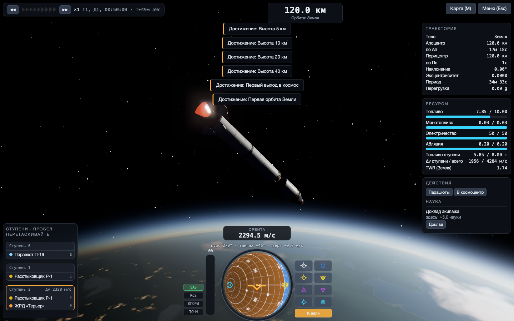
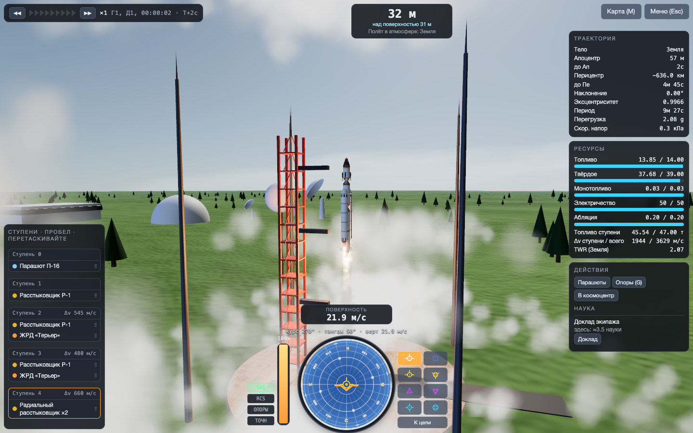
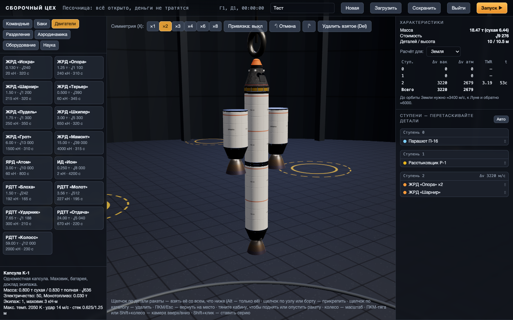
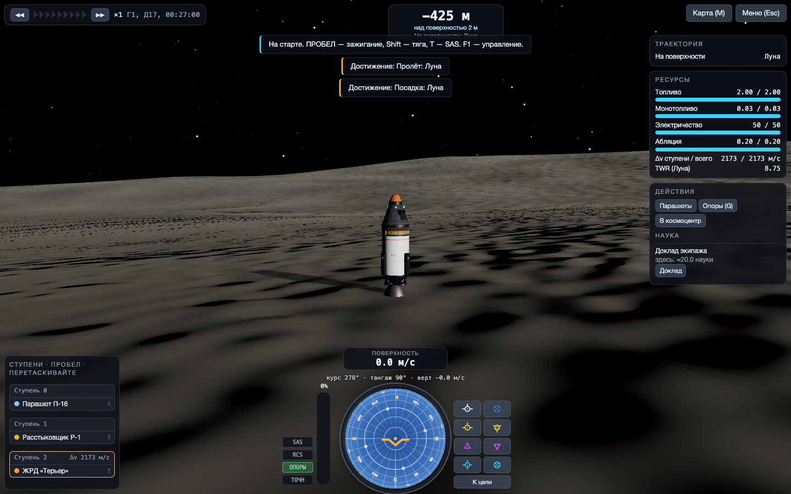
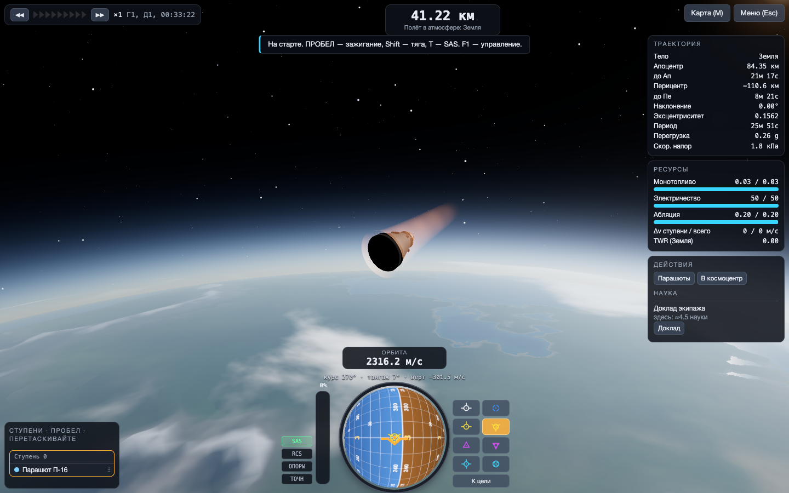
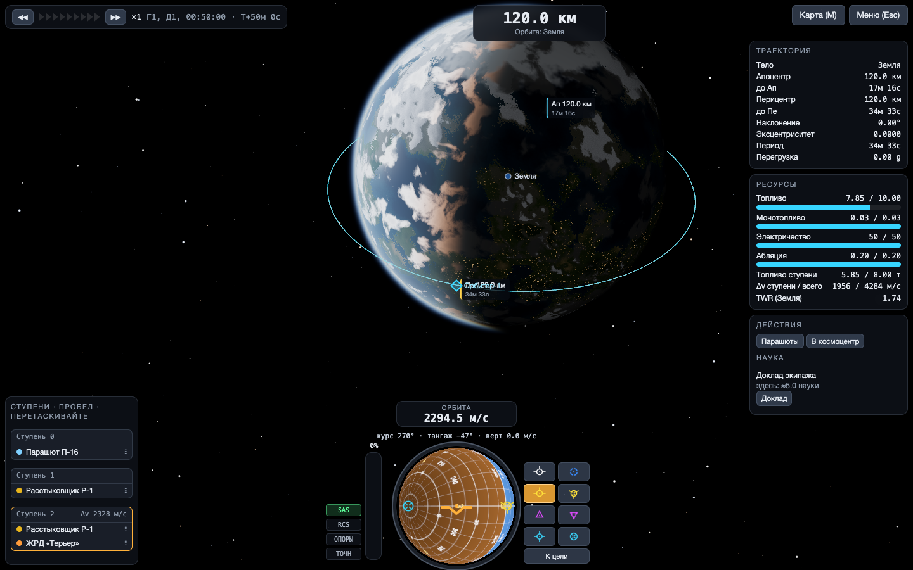
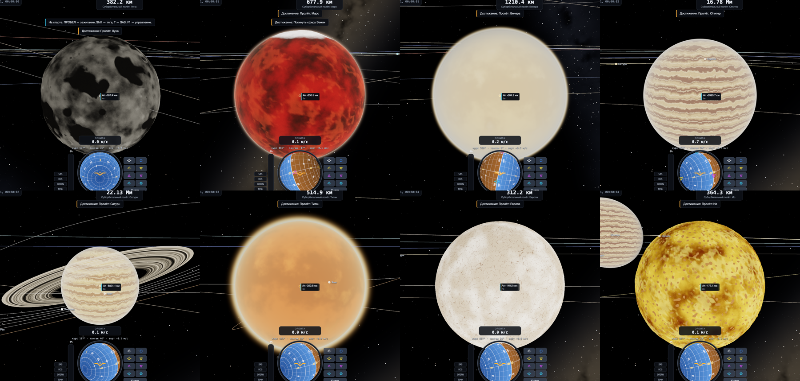

# ОРБИТА

Космическая программа в браузере в духе Kerbal Space Program. Вы собираете ракеты из деталей, запускаете их с настоящей орбитальной механикой и летаете по всей Солнечной системе. Есть рельеф, на который можно сесть, карьера с наукой, контракты и дерево технологий.

Игра написана на чистом JavaScript с three.js для графики. Сборки нет, сервер не нужен, ничего ставить не надо.

| | |
|---|---|
|  |  |
|  |  |
|  |  |

## Запуск

Откройте `index.html` в браузере. Игра работает прямо с `file://`. Проверено в Chromium и WebKit (движок Safari), Firefox не проверялся. Прогресс хранится в браузере (localStorage). Сохранение можно выгрузить в файл и загрузить обратно. Если видеокарта не справляется, понизьте качество: Меню (Esc) → Графика. Там же меняется поле зрения.

## Что есть

**Солнечная система** — 32 тела: Солнце, все 8 планет, Церера, Плутон и 21 крупный спутник, включая Луну, Фобос, Деймос, галилеевы луны, Титан, Энцелад, Япет, спутники Урана, Тритон и Харон. Планеты движутся по реальным элементам орбит J2000. Масштаб 1:10, как у популярных уменьшенных модов к KSP: расстояния ×0.1, гравитационные параметры ×0.01, поэтому ускорение свободного падения на поверхности остаётся настоящим. До орбиты Земли нужно около 3.4 км/с, год длится 365 игровых дней.

**Рельеф** — у каждого твёрдого тела процедурная поверхность:
- **Земля:** континенты, горы до 3.5 км, океаны (в них можно приводниться) и ровная площадка космодрома.
- **Луна, Меркурий, Каллисто и другие:** поля кратеров с валами и центральными горками.
- **Марс:** выступ высотой 12 км.
- **Ледяные луны:** трещины.
- **Титан:** метановые озёра.
- **Фобос и Деймос:** бугристые «картофелины».

Рельеф общий для графики и физики: сесть можно на склон или в кратер, разбиться — о гору.

**Физика полёта:**
- корабль — твёрдое тело с тензором инерции, центр масс смещается по мере выработки топлива;
- тяга и удельный импульс двигателей зависят от давления;
- топливо течёт внутри секций между расстыковщиками;
- аэродинамика считается по каждой детали в атмосфере, которая вращается вместе с планетой. Отсюда настоящая устойчивость: стабилизаторы у хвоста держат ракету носом вперёд;
- нагрев при входе в атмосферу и абляция теплощита, детали разрушаются от перегрева;
- парашюты раскрываются частично, затем полностью на 1 км над рельефом;
- контакт с наклонной поверхностью через пружины-демпферы, опоры, разрушение при жёстком ударе.

**Орбитальная механика** — патченные коники: сферы влияния, переходы между ними, прогноз траектории на несколько патчей вперёд с метками апоцентра, перицентра, входа и выхода. Есть узлы манёвров с векторами прогрейд/нормаль/радиально и точкой ближайшего сближения с целью. Ускорение времени двух видов: физическое до ×4 и «на рельсах» до ×10 000 000, с автоматической остановкой у сферы влияния, атмосферы и рельефа.

**Графика:**
- **Конвейер:** HDR, MSAA, свечение ярких объектов и тональная компрессия.
- **Тени:** корабль отбрасывает тень на себя, на стартовый стол и на грунт.
- **Атмосфера:** рассеяние света с закатами и дымкой, облака Земли с закатной подсветкой, огни городов на ночной стороне.
- **Небо:** Млечный Путь и звёзды разного цвета. Солнце краснеет и тускнеет у горизонта.
- **Детали:** физически корректные материалы с процедурными картами нормалей. На баках сварные швы и заклёпки, у капсулы плитки теплозащиты и иллюминаторы. Сопла нагреваются до свечения.
- **Факелы:** у земли короткие, с ромбами ударных волн, в вакууме широкие. Свет двигателя освещает стартовый стол.
- **Эффекты:** дымный след, клубы пара при старте, пыль от двигателя на безатмосферных телах, плазма при входе в атмосферу, взрывы.

**Сборочный цех:**
- 71 деталь: капсулы, зонды, баки, жидкостные, твердотопливные, ядерный и ионный двигатели, расстыковщики, переходники, обтекатели, стабилизаторы, парашюты, теплощиты, опоры, РСУ, батареи, солнечные панели, антенны, научные приборы;
- детали крепятся в узлы и на борт любой детали, в том числе баки и двигатели без расстыковщика, боковые блоки на боковые блоки, радиальная симметрия ×1–8;
- щелчок по детали ракеты берёт её вместе со всем, что висит ниже (Alt — только её); взятое можно переставить или удалить щелчком по каталогу; правая кнопка или Esc возвращают на место;
- ракету можно поднять или опустить по цеху, потянув за кабину;
- ступени перестраиваются перетаскиванием деталей между ступенями, в цехе и прямо в полёте;
- расчёт Δv и TWR по ступеням для любого тела, отмена и повтор действий, сохранение ракет.

**Карьера:**
- 8 научных экспериментов: доклад экипажа, температура, давление, гель, материаловедение, сейсмика, гравиметрия, анализ атмосферы;
- ситуации полёта (на поверхности, нижняя или верхняя атмосфера, низкий или высокий космос) и множители тел;
- убывающая отдача от повторов, передача данных по антенне или возврат на Землю;
- дерево из 21 технологии;
- контракты: рекорды высоты, орбиты, пролёты, посадки, возвращение, научные данные, спутник на заданную орбиту;
- вехи («первая орбита», «посадка на Луну» и т.д.), деньги и репутация.

**Остальное** — навбол, SAS (стабилизация, прогрейд/ретрогрейд, нормаль, радиально, манёвр, цель), станция слежения, переключение между аппаратами, отмена запуска, быстрое сохранение и загрузка (F5/F9), песочница.

## Управление

| клавиша | действие |
|---|---|
| W/S, A/D, Q/E | тангаж, рыскание, крен |
| Shift / Ctrl, Z / X | тяга плавно, полная / ноль |
| Пробел | следующая ступень |
| T, R, G | SAS, РСУ, опоры |
| H/N, I/K, J/L | РСУ: вперёд/назад, вверх/вниз, влево/вправо |
| M | карта (щелчок по траектории — новый манёвр, Tab — фокус) |
| . / , / `/` | ускорение времени ± / сброс; Alt+. — физическое ускорение |
| [ ] | переключить аппарат рядом |
| F5 / F9 | быстрое сохранение / загрузка |
| Esc, F1 | пауза, помощь |
| Мышь | тянуть — вращать камеру, колесо — масштаб |

Как выйти на орбиту: старт вертикально, с 1–2 км плавно наклоняйте на восток (D), к 40 км ракета должна идти почти горизонтально. Когда апоцентр выше 75 км, выключите тягу. У апоцентра разгоняйтесь по прогрейду, пока перицентр не поднимется выше 70 км.

В цехе: щелчок по детали в каталоге, затем по зелёному узлу или по борту ракеты. Щелчок по детали ракеты — взять, по каталогу — удалить. Тянуть кабину — двигать ракету. X — симметрия, Ctrl+Z — отмена.

## Упрощения

Сделано сознательно, чтобы игра оставалась играбельной в браузере:
- у планет нет наклона оси, все вращаются вокруг полюса эклиптики. Космодром стоит на экваторе;
- высоты атмосфер подобраны для игры: буквальный масштаб 1:10 дал бы шкалу высот около 1 км;
- рельеф не отбрасывает тени на самого себя (тени есть только от кораблей и построек);
- топливо и окислитель объединены в один ресурс, топливных магистралей нет;
- нет выхода в открытый космос, стыковки, крыльев, биомов, улучшений зданий и звука.

## Устройство

`src/` — модули без сборки:
- `math`, `orbit` (коники, патчи, прогноз), `bodies` (данные системы), `terrain` (рельеф для физики и графики);
- `parts` (каталог, эксперименты, технологии), `vessel` (раскладка, ступени, Δv), `physics`;
- `career` (наука, контракты, сохранения);
- `render` (планеты, атмосфера, облака, небо, участок рельефа под камерой, постобработка), `partmesh` (детали, материалы, факелы, частицы), `navball`, `mapview`, `vab`, `ui`, `game`.

`tests/` — проверки без браузера (`node tests/test_orbit.js`, `test_vessel.js`, `test_flight.js`, `test_heat.js`, `test_terrain.js`) и браузерные сценарии через Playwright (`node tests/browser.js <сценарий>`):
- автопилот выводит ракету на орбиту и сажает капсулу на рельеф;
- перелёт к Луне со сменой сферы влияния на рельсах;
- подскок и посадка на опоры на Луне;
- сборка ракеты в цехе реальными щелчками мыши: снять деталь, удалить через каталог, прикрепить бак на борт, поднять ракету за кабину, перетащить ступени в цехе и в полёте;
- сохранение и загрузка посреди полёта;
- галерея кадров (`gallery`, `planets`, `liftoff`) для визуальной проверки.

three.js r180 лежит в `vendor/` (лицензия MIT).
