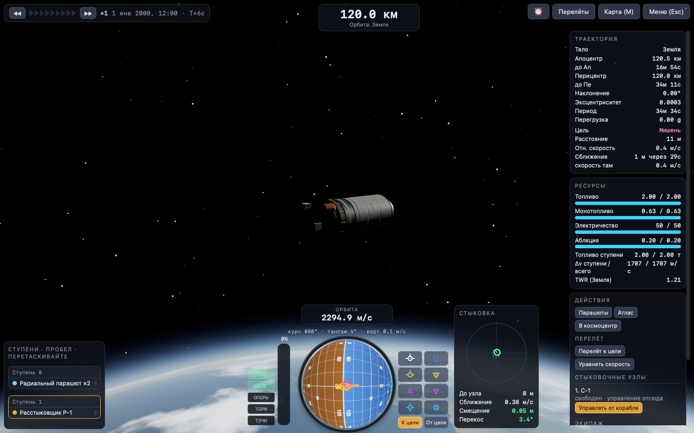
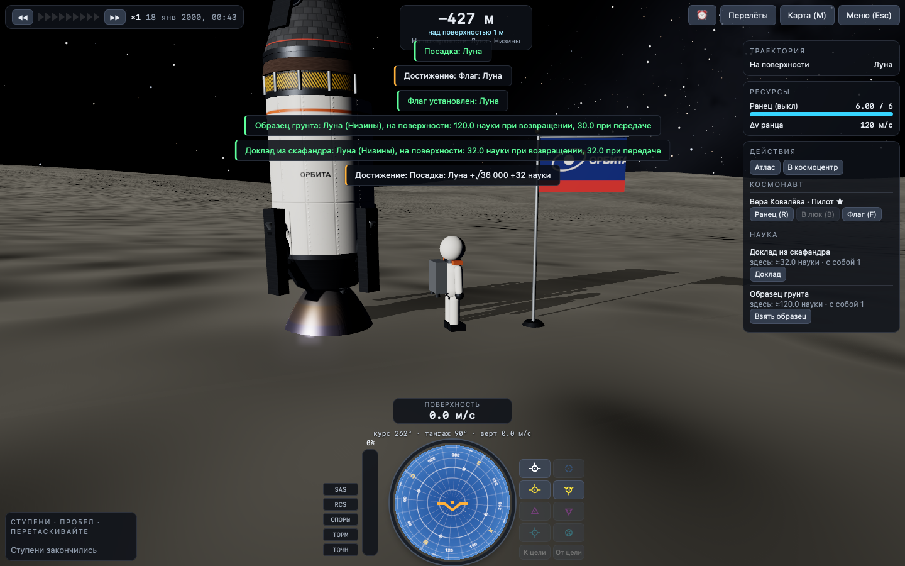
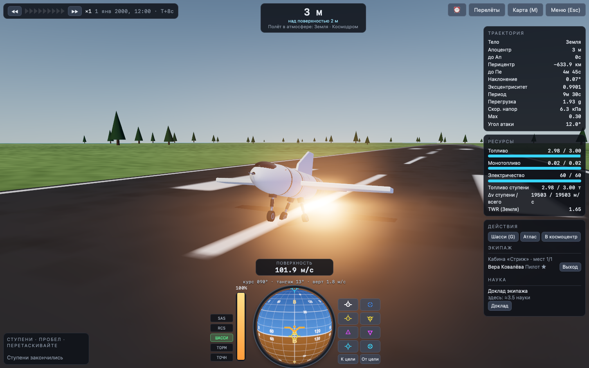
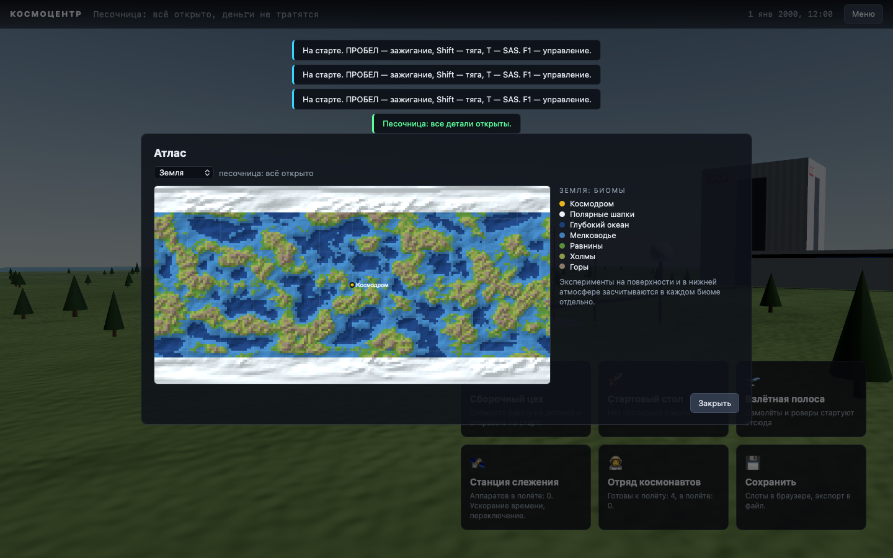
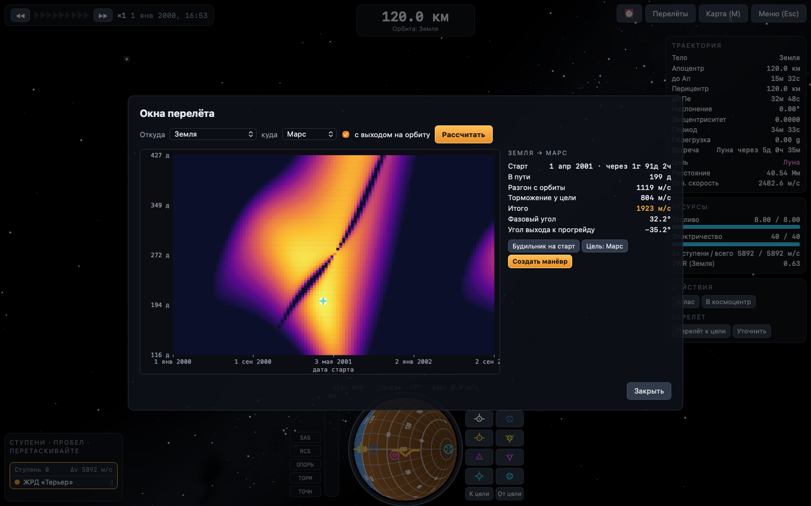
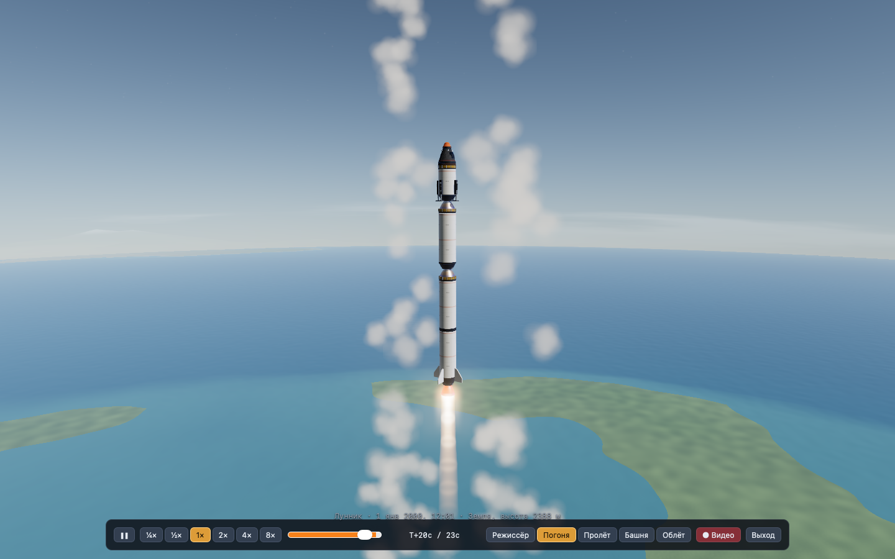

# ОРБИТА

Космическая программа в браузере в духе Kerbal Space Program. Вы собираете ракеты из деталей, запускаете их с настоящей орбитальной механикой и летаете по всей Солнечной системе. Есть рельеф, на который можно сесть, карьера с наукой, контракты и дерево технологий.

Игра написана на чистом JavaScript с three.js для графики. Сборки нет, сервер не нужен, ничего ставить не надо.

| | |
|---|---|
|  |  |
|  |  |
|  |  |
|  |  |
|  |  |
|  |  |

## Запуск

Откройте `index.html` в браузере. В меню выберите «Космическую гонку · 1957», карьеру или песочницу (с датой старта). Игра работает прямо с `file://`. Проверено в Chromium и WebKit (движок Safari), Firefox не проверялся. Прогресс хранится в браузере (localStorage). Сохранение можно выгрузить в файл и загрузить обратно. Если видеокарта не справляется, понизьте качество: Меню (Esc) → Графика. Там же меняется поле зрения.

## Что есть

**Солнечная система** — 32 тела: Солнце, все 8 планет, Церера, Плутон и 21 крупный спутник, включая Луну, Фобос, Деймос, галилеевы луны, Титан, Энцелад, Япет, спутники Урана, Тритон и Харон. Планеты движутся по реальным элементам орбит J2000. Масштаб 1:10, как у популярных уменьшенных модов к KSP: расстояния ×0.1, гравитационные параметры ×0.01, поэтому ускорение свободного падения на поверхности остаётся настоящим. До орбиты Земли нужно около 3.4 км/с, год длится 365 игровых дней.

**Рельеф** — у каждого твёрдого тела процедурная поверхность:
- **Земля:** континенты, горы до 3.5 км, океаны (в них можно приводниться) и ровная площадка космодрома.
- **Луна, Меркурий, Каллисто и другие:** поля кратеров с валами и центральными горками.
- **Марс:** выступ высотой 12 км.
- **Ледяные луны:** трещины.
- **Титан:** метановые озёра.
- **Фобос и Деймос:** бугристые «картофелины».

Рельеф общий для графики и физики: сесть можно на склон или в кратер, разбиться — о гору.

**Физика полёта:**
- корабль — твёрдое тело с тензором инерции, центр масс смещается по мере выработки топлива;
- тяга и удельный импульс двигателей зависят от давления;
- топливо течёт внутри секций между расстыковщиками;
- аэродинамика считается по каждой детали в атмосфере, которая вращается вместе с планетой. Отсюда настоящая устойчивость: стабилизаторы у хвоста держат ракету носом вперёд;
- нагрев при входе в атмосферу и абляция теплощита, детали разрушаются от перегрева;
- парашюты раскрываются частично, затем полностью на 1 км над рельефом;
- контакт с наклонной поверхностью через пружины-демпферы, опоры, разрушение при жёстком ударе.

**Орбитальная механика** — патченные коники: сферы влияния, переходы между ними, прогноз траектории на несколько патчей вперёд с метками апоцентра, перицентра, входа и выхода. Есть узлы манёвров с векторами прогрейд/нормаль/радиально и точкой ближайшего сближения с целью. Ускорение времени двух видов: физическое до ×4 и «на рельсах» до ×10 000 000, с автоматической остановкой у сферы влияния, атмосферы и рельефа.

**Графика:**
- **Конвейер:** HDR, MSAA, свечение ярких объектов и тональная компрессия.
- **Тени:** корабль отбрасывает тень на себя, на стартовый стол и на грунт.
- **Атмосфера:** рассеяние света с закатами и дымкой, облака Земли с закатной подсветкой, огни городов на ночной стороне.
- **Небо:** Млечный Путь и звёзды разного цвета. Солнце краснеет и тускнеет у горизонта.
- **Детали:** физически корректные материалы с процедурными картами нормалей. На баках сварные швы и заклёпки, у капсулы плитки теплозащиты и иллюминаторы. Сопла нагреваются до свечения.
- **Факелы:** у земли короткие, с ромбами ударных волн, в вакууме широкие. Свет двигателя освещает стартовый стол.
- **Эффекты:** дымный след, клубы пара при старте, пыль от двигателя на безатмосферных телах, плазма при входе в атмосферу, взрывы.

**Сборочный цех:**
- 71 деталь: капсулы, зонды, баки, жидкостные, твердотопливные, ядерный и ионный двигатели, расстыковщики, переходники, обтекатели, стабилизаторы, парашюты, теплощиты, опоры, РСУ, батареи, солнечные панели, антенны, научные приборы;
- детали крепятся в узлы и на борт любой детали, в том числе баки и двигатели без расстыковщика, боковые блоки на боковые блоки, радиальная симметрия ×1–8;
- щелчок по детали ракеты берёт её вместе со всем, что висит ниже (Alt — только её); взятое можно переставить или удалить щелчком по каталогу; правая кнопка или Esc возвращают на место;
- ракету можно поднять или опустить по цеху, потянув за кабину;
- ступени перестраиваются перетаскиванием деталей между ступенями, в цехе и прямо в полёте;
- расчёт Δv и TWR по ступеням для любого тела, отмена и повтор действий, сохранение ракет.

**Карьера:**
- 8 научных экспериментов: доклад экипажа, температура, давление, гель, материаловедение, сейсмика, гравиметрия, анализ атмосферы;
- ситуации полёта (на поверхности, нижняя или верхняя атмосфера, низкий или высокий космос) и множители тел;
- убывающая отдача от повторов, передача данных по антенне или возврат на Землю;
- дерево из 21 технологии;
- контракты: рекорды высоты, орбиты, пролёты, посадки, возвращение, научные данные, спутник на заданную орбиту;
- вехи («первая орбита», «посадка на Луну» и т.д.), деньги и репутация.

**Звук** — синтезируется на лету через WebAudio, без звуковых файлов:
- двигатели (гул, рёв, шипение, треск твердотопливных, тонкий гул ионных), в вакууме слышна только глухая вибрация корпуса;
- ветер по скоростному напору, рёв плазмы при входе в атмосферу, пшики РСУ;
- события: отделение ступеней, стыковка, взрывы (затихают с расстоянием, в вакууме не слышны), парашюты, опоры, касание грунта, приводнение, шаги и ранец космонавта;
- фон: ветер у космодрома, гул цеха, кабина в космосе, космический дрон в меню; громкость в «Настройках».

**Стыковка** — стыковочные узлы 0.625 и 1.25 м. Узел стыкуется свободным торцом. Ближе 1.6 м магнит подтягивает и доворачивает корабли, захват при сближении медленнее 1.2 м/с и перекосе до 12°. Два корабля становятся одним телом: импульс сохраняется, топливо общее, ступени объединяются. Расстыковка возвращает второму кораблю имя. Корабль можно сделать целью (щелчок на карте): навбол показывает направление на цель и относительную скорость (режим «ЦЕЛЬ»), SAS «к цели» и «от цели», управление «от стыковочного узла», индикатор соосности с расстоянием, смещением и перекосом, точка наибольшего сближения и орбита цели на карте.

**Экипаж и выход в открытый космос:**
- отряд космонавтов: пилоты, инженеры, учёные, уровни опыта, набор новых. Опыт за пролёты, орбиты, посадки и флаги засчитывается после возвращения на Землю;
- пилот открывает режимы SAS по уровню (в карьере), инженер перепаковывает парашюты, учёный перезапускает одноразовые эксперименты и даёт +25% к науке экипажа;
- экипаж назначается при старте (вручную — кнопка «Экипаж» в цехе), пустая капсула без зонда не управляется, гибель экипажа учитывается;
- выход в открытый космос: ходьба и прыжки по поверхности, ранец на ~120 м/с (поднимает на Луне, но не на Земле), доклад из скафандра, образец грунта, флаг, возвращение в любой люк со свободным местом;
- контракты: спасение космонавта с брошенной капсулы (вступает в отряд), выход в открытый космос, флаг, стыковка.

**Планирование:**
- будильник: манёвры, апоцентр, перицентр, смена сферы влияния, «через…», окна перелёта; ускорение времени останавливается перед ними;
- окна перелёта: диаграмма «порк-чоп» Δv по дате старта и времени в пути (решатель Ламберта), фазовый угол и угол выхода, будильник на старт, манёвр разгона;
- «Перелёт к цели»: манёвр к Луне, к кораблю на орбите или к планете в ближайшее окно, с автоматическим уточнением до нужного перицентра или сближения; «Уравнять скорость» в точке сближения;
- прогноз посадки: траектория с сопротивлением атмосферы и раскрытием парашютов до касания, на карте и меткой над местностью, время и скорость касания.

**Самолёты и роверы:**
- крылья с подъёмной силой и срывом потока, индуктивным сопротивлением; элевоны сами работают на тангаж, рыскание или крен в зависимости от того, где стоят;
- турбореактивные двигатели «Сокол» (до ~3 М) и «Вихрь» (до ~5.5 М): только в кислородной атмосфере Земли, тяга зависит от плотности воздуха и числа Маха, турбина раскручивается;
- шасси с подвеской, тормозами (B), рулением передней стойкой и уборкой (G); ведущие колёса роверов на электричестве (W/S — газ, A/D — руль);
- взлётная полоса у космодрома с разметкой, старт «стол/полоса» в цехе; на панели полёта — число Маха и угол атаки;
- готовые «Стриж» (реактивный самолёт) и «Луноход» (ровер).

**Биомы и Атлас** — у каждого твёрдого тела свои районы: на Земле космодром, океаны, мелководье, равнины, холмы, горы и полярные шапки; на Луне моря, низины, равнины, нагорья и полюса; на Марсе вулканическое плато, низменности, высокогорья и шапки; на Титане метановые моря. Эксперименты на поверхности и в нижней атмосфере засчитываются в каждом биоме отдельно. Картограф на орбите снимает полосу под собой (и при ускорении времени), открывает биомы в Атласе и приносит науку за покрытие. Атлас — плоская карта тела с биомами, рельефом, аппаратами, флагами и прогнозом посадки.

**Настоящий календарь** — игровые сутки в системе 1:10 равны календарному дню, а планеты движутся по настоящим орбитам J2000. Поэтому в любой выбранный день Луна, Марс и остальные стоят там же, где на настоящем небе: окна перелётов и фазы Луны совпадают с реальными. Новую игру можно начать 1 января 2000, сегодня или в любой день с 1950 по 2100 год.

**Космическая гонка · 1957** — отдельный режим карьеры со 2 января 1957 года. Соперник, Агентство «Горизонт», идёт по настоящей хронологии космических первенств: спутник 4 октября 1957, пролёт Луны, человек на орбите, выход в открытый космос, посадка на Луну, стыковка, люди на Луне 20 июля 1969, Венера, Марс, внешние планеты. Успели раньше даты — рубеж ваш и большая награда; опоздали — соперник забирает новости и часть репутации. Ракеты собираются не мгновенно (дни и недели по стоимости и числу деталей), очередь сборки и перемотка календаря — в космоцентре.

**Памятные места** — настоящие места посадок как точки интереса: «Луна-9», «Аполлон-11» и «-17», «Луноход-1», «Луна-16», «Чанъэ-4», «Венера-7» и «-9», «Марс-3», «Викинг-1», «Марс Пасфайндер», «Кьюриосити», «Гюйгенс». На поверхности стоят модели аппаратов, места видны в Атласе. Посадка ближе 2.5 км — место найдено, космонавт ближе 40 м — осмотрено (наука и репутация). В гонке место появляется, только когда соперник туда сел.

**Повторы и видео** — каждый полёт записывается. Повтор (Esc → «Повтор полёта», из окна потери корабля или из космоцентра) показывает те же модели, факелы, дым и огонь входа в атмосферу. Камеры: «Режиссёр» сам переключает планы, «Башня» — длиннофокусная съёмка старта с земли, «Пролёт», «Погоня», «Облёт». Скорость от ¼ до 8×, перемотка. «● Видео» пишет кадры без интерфейса в mp4 (Safari) или webm и сохраняет файл.

**Ракета по ссылке** — кнопка «Ссылка» в цехе сжимает ракету в короткий код (около 500 символов) и ссылку с `#craft=`. Ссылка открывает ракету в песочнице, код вставляется в «Загрузить» → «Код или ссылка».

**Остальное** — навбол, SAS (стабилизация, прогрейд/ретрогрейд, нормаль, радиально, манёвр, цель), станция слежения, переключение между аппаратами, отмена запуска, быстрое сохранение и загрузка (F5/F9), песочница, динамическое разрешение (на Retina картинка сама понижает чёткость, чтобы держать 50–60 кадров).

## Управление

| клавиша | действие |
|---|---|
| W/S, A/D, Q/E | тангаж, рыскание, крен |
| Shift / Ctrl, Z / X | тяга плавно, полная / ноль |
| Пробел | следующая ступень |
| T, R, G, B | SAS, РСУ, опоры и шасси, тормоз |
| Самолёт и ровер | S — взять на себя; A/D — руль и руление; у ровера W/S — газ |
| В открытом космосе | WASD — движение относительно камеры, Shift/Ctrl — вверх/вниз, R — ранец, Пробел — прыжок, B — в люк, F — флаг |
| H/N, I/K, J/L | РСУ: вперёд/назад, вверх/вниз, влево/вправо |
| M | карта (щелчок по траектории — новый манёвр, Tab — фокус) |
| . / , / `/` | ускорение времени ± / сброс; Alt+. — физическое ускорение |
| [ ] | переключить аппарат рядом |
| F5 / F9 | быстрое сохранение / загрузка |
| Esc, F1 | пауза, помощь |
| Мышь | тянуть — вращать камеру, колесо — масштаб |

Как выйти на орбиту: старт вертикально, с 1–2 км плавно наклоняйте на восток (D), к 40 км ракета должна идти почти горизонтально. Когда апоцентр выше 75 км, выключите тягу. У апоцентра разгоняйтесь по прогрейду, пока перицентр не поднимется выше 70 км.

В цехе: щелчок по детали в каталоге, затем по зелёному узлу или по борту ракеты. Щелчок по детали ракеты — взять, по каталогу — удалить. Тянуть кабину — двигать ракету. X — симметрия, Ctrl+Z — отмена.

## Упрощения

Сделано сознательно, чтобы игра оставалась играбельной в браузере:
- у планет нет наклона оси, все вращаются вокруг полюса эклиптики. Космодром стоит на экваторе;
- высоты атмосфер подобраны для игры: буквальный масштаб 1:10 дал бы шкалу высот около 1 км;
- рельеф не отбрасывает тени на самого себя (тени есть только от кораблей и построек);
- топливо и окислитель объединены в один ресурс, топливных магистралей нет;
- аппараты не сталкиваются друг с другом (только с поверхностью);
- реактивным двигателям не нужны воздухозаборники;
- нет улучшений зданий.

## Устройство

`src/` — модули без сборки:
- `math`, `orbit` (коники, патчи, прогноз), `bodies` (данные системы), `terrain` (рельеф для физики и графики);
- `parts` (каталог, эксперименты, технологии), `vessel` (раскладка, ступени, Δv, ориентация деталей), `physics`, `docking` (захват, слияние, расстыковка), `eva` (космонавт снаружи);
- `planner` (Ламберт, порк-чоп, автоманёвры, прогноз посадки), `audio` (процедурный звук), `biomes` (биомы, картограф);
- `race` (хронология соперника, памятные места, сборка), `replay` (запись, повторы, кинокамеры, видео);
- `career` (наука, контракты, сохранения);
- `render` (планеты, атмосфера, облака, небо, участок рельефа под камерой, постобработка), `partmesh` (детали, материалы, факелы, частицы), `navball`, `mapview`, `vab`, `ui`, `game`.

`tests/` — проверки без браузера (`node tests/test_orbit.js`, `test_vessel.js`, `test_flight.js`, `test_heat.js`, `test_terrain.js`, `test_dock.js`, `test_eva.js`, `test_planner.js`, `test_aircraft.js`, `test_biomes.js`, `test_race.js`) и браузерные сценарии через Playwright (`node tests/browser.js <сценарий> [webkit]`; WebKit рисует на настоящей видеокарте, Chromium — программно):
- автопилот выводит ракету на орбиту и сажает капсулу на рельеф;
- перелёт к Луне со сменой сферы влияния на рельсах;
- подскок и посадка на опоры на Луне;
- сборка ракеты в цехе реальными щелчками мыши: снять деталь, удалить через каталог, прикрепить бак на борт, поднять ракету за кабину, перетащить ступени в цехе и в полёте;
- сохранение и загрузка посреди полёта;
- стыковка по РСУ с индикатором соосности, выход в открытый космос, прогулка по Луне с флагом (`dock`, `eva`);
- автоперелёт к Луне, будильник, порк-чоп, прогноз посадки, сближение со станцией (`plan`), офлайн-замер звука (`audio`);
- взлёт «Стрижа» с полосы с клавиатуры и езда «Лунохода» (`air`), картограф на полярной орбите Луны и Атлас (`atlas`);
- гонка со сборкой и ожиданием, место «Аполлона-11» (`race`), ракета по ссылке (`share`), повтор с камерами и запись видео (`replay`);
- галерея кадров (`gallery`, `planets`, `liftoff`) для визуальной проверки.

three.js r180 лежит в `vendor/` (лицензия MIT).
